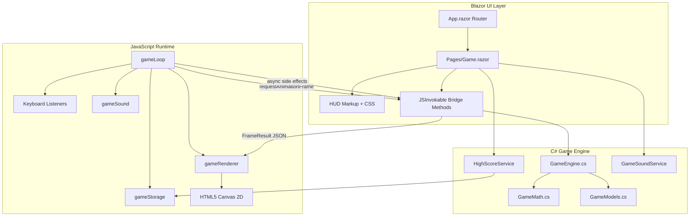
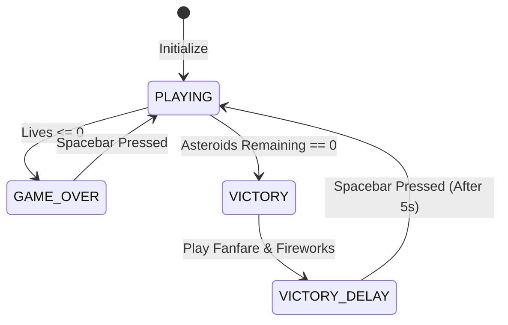
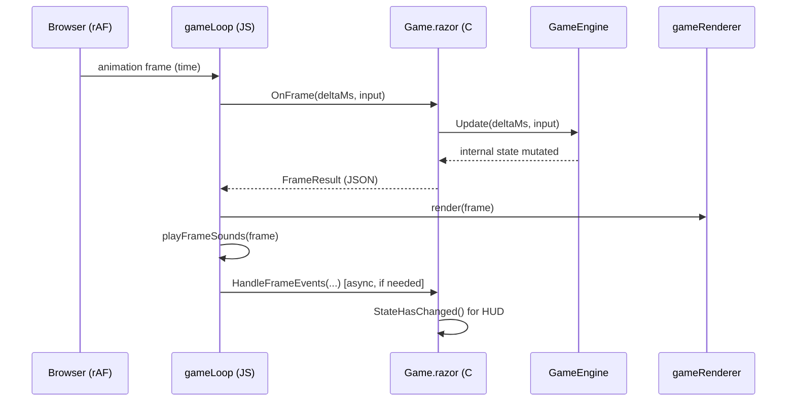
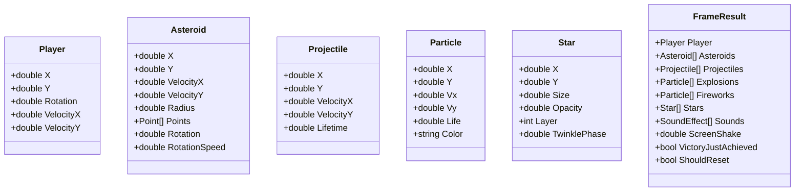

# Solution Architecture: Asteroids Blazor WebAssembly Implementation

This document describes the technical architecture of the Blazor WebAssembly port of the Asteroids game (sibling project: `../asteroids01`).

## 1. High-Level System Overview

The application is a browser-based 2D arcade game built with **Blazor WebAssembly (.NET 10, C# 14)** and the **HTML5 Canvas API**. It uses a **hybrid C#/JavaScript architecture**:

- **C#** owns game logic, physics, collision detection, and scoring rules.
- **JavaScript** owns the render loop, canvas drawing, keyboard input, procedural audio, and `localStorage`.
- **Blazor** provides the HUD overlay and the JS interop bridge between the two runtimes.

This split mirrors the React version's "ref-state" pattern: high-frequency simulation runs outside the UI reconciliation path, while low-frequency HUD updates flow through Blazor component state.

### System Architecture Diagram



---

## 2. Technology Stack

| Layer | Technology | Purpose |
| :--- | :--- | :--- |
| **Runtime** | .NET 10 WebAssembly | Runs C# in the browser |
| **UI Framework** | Blazor WebAssembly | Component model, routing, HUD |
| **Language** | C# 14 | Game engine, types, services |
| **Rendering** | HTML5 Canvas 2D (JavaScript) | 60 FPS drawing with glow, particles, screen shake |
| **Interop** | `IJSRuntime` + `[JSInvokable]` | Bidirectional C# ↔ JS communication |
| **Audio** | Web Audio API (JavaScript) | Procedural thrust, shoot, explosion, victory sounds |
| **Persistence** | `localStorage` (JavaScript) | Top 10 best completion times |
| **Styling** | CSS (`wwwroot/css/app.css`) | Glass-style HUD, overlays, scanline effect |

---

## 3. Project Structure

```
asteroids02/
├── Program.cs                 # WASM host bootstrap, DI registration
├── App.razor                  # Router
├── Pages/
│   └── Game.razor             # Main game page, HUD, JS interop bridge
├── Layout/
│   └── EmptyLayout.razor      # Minimal full-screen layout (no nav chrome)
├── Game/
│   ├── GameEngine.cs          # Core simulation loop logic
│   ├── GameMath.cs            # Utilities, procedural asteroid/star generation
│   └── GameConstants.cs       # Balance constants (lives, speeds, sizes)
├── Models/
│   └── GameModels.cs          # Entity DTOs and FrameResult
├── Services/
│   ├── HighScoreService.cs    # localStorage wrapper via JS interop
│   └── GameSoundService.cs    # Audio wrapper (available; sounds played in JS loop)
└── wwwroot/
    ├── index.html             # Host page, Blazor + game.js script tags
    ├── css/app.css            # HUD and overlay styling
    └── js/game.js             # Game loop, renderer, audio, storage
```

---

## 4. Game State Machine

The game transitions between distinct states. Victory includes a timed delay before restart is allowed, so the fanfare and fireworks can play out.



---

## 5. The Game Loop & Execution Flow

The browser drives timing via `requestAnimationFrame` in `wwwroot/js/game.js`. Each frame:

1. JS computes `delta` time since the last frame.
2. JS calls `dotNetRef.invokeMethodAsync('OnFrame', delta, input)` into C#.
3. C# runs `GameEngine.Update()` and returns a `FrameResult` snapshot.
4. JS renders the snapshot to canvas, plays sounds, and dispatches async side effects.

### Execution Sequence



### Frame-rate Independence

Movement uses **delta time** (`dt` in seconds):

```
position += velocity * dt
rotation += angularSpeed * dt
```

This keeps gameplay consistent regardless of frame rate.

---

## 6. JS Interop Design

### Synchronous frame path (`OnFrame`)

`OnFrame` is intentionally **synchronous and side-effect-free** with respect to JavaScript. It must not call `IJSRuntime` or `InvokeAsync` during the call, because it is invoked from within the JS animation loop. Re-entrant async interop from a sync callback can deadlock or silently break Blazor WASM.

`OnFrame` returns a `FrameResult` containing everything JS needs for that frame:

- Entity positions and velocities
- Star field data
- Particle lists (explosions, fireworks)
- Sound effect enums to play
- Screen shake intensity
- Flags for victory/reset and pending scores

### Asynchronous side-effect path (`HandleFrameEvents`)

After rendering, JS optionally calls `HandleFrameEvents` for work that requires async interop:

- Persisting high scores to `localStorage`
- Updating Blazor HUD state (`StateHasChanged`)
- Resetting the game on spacebar after game over / victory

### Other interop entry points

| Method | Direction | Purpose |
| :--- | :--- | :--- |
| `OnResize(width, height)` | JS → C# | Canvas resize; initialize or regenerate stars |
| `gameLoop.start(canvas, dotNetRef)` | C# → JS | Start rAF loop, attach keyboard listeners |
| `gameLoop.stop()` | C# → JS | Tear down on component dispose |
| `gameStorage.*` | C# → JS | Read/write high scores |
| `gameSound.play(...)` | JS (internal) | Procedural audio synthesis |

---

## 7. Data Model & Entities



All entities are plain mutable objects for performance. `FrameResult` is a per-frame snapshot serialized to JSON for JavaScript.

---

## 8. Implementation Deep Dives

### 8.1 Hybrid State Management

| Concern | Owner | Update Frequency |
| :--- | :--- | :--- |
| Physics, collisions, entity lists | `GameEngine` (C# fields) | Every frame (~60 Hz) |
| Canvas pixels | `gameRenderer` (JS) | Every frame |
| HUD (time, lives, asteroid count) | `Game.razor` Blazor state | Every 100 ms via `System.Threading.Timer` |
| High scores | `HighScoreService` + `localStorage` | On victory / reset |

The HUD timer calls `_engine.SyncHudState()` and then `StateHasChanged()` on the Blazor dispatcher. This avoids re-rendering the HUD 60 times per second.

### 8.2 Physics & Collision Engine

- **Integration**: Euler integration (`pos += vel * dt`).
- **Screen wrapping**: Player and projectiles use `Wrap()`. Asteroids use `WrapRadius()` so they fully exit the viewport before reappearing.
- **Radial collision**: Euclidean distance check against asteroid radius (plus a small buffer for player hits).
- **Asteroid splitting**: Large → two medium; medium → two small; small → destroyed.

### 8.3 Procedural Asteroid Generation

Asteroids are irregular polygons, not circles:

1. Place vertices around a circle at randomized angles.
2. Apply a random radius multiplier (0.7–1.3×) per vertex.
3. Connect vertices to form a jagged rock outline.

### 8.4 Visual Effects (JavaScript Renderer)

The renderer adds polish beyond the original wireframe aesthetic:

- Parallax star field with twinkling and nebula gradients
- Neon glow via `shadowBlur` on ship, asteroids, and lasers
- Engine trail particles while thrusting
- Explosion spark particles on asteroid destruction and player hits
- Screen shake on impacts
- Vignette and subtle scanline overlay (CSS)

### 8.5 Sound Engine (Procedural Synthesis)

Audio is synthesized in JavaScript using the Web Audio API — no audio files:

| Effect | Technique |
| :--- | :--- |
| **Thrust** | Triangle wave + 6 Hz LFO frequency modulation |
| **Shoot** | Square wave with rapid frequency decay |
| **Explosion** | Multiple overlapping sawtooth/square oscillators |
| **Player hit** | Sawtooth with low-frequency ramp |
| **Victory** | Ascending triangle-wave arpeggio |

### 8.6 High Scores

- Stored in `localStorage` under key `asteroids_highscores`.
- Lower time is better (fastest completion wins).
- Top 10 times are kept, sorted ascending.
- Scores are recorded on victory and when resetting after a run.

---

## 9. Startup & Hosting

```
index.html
  └─ blazor.webassembly.js   (boots .NET WASM runtime)
  └─ game.js                  (registers window.gameLoop, gameRenderer, etc.)

Program.cs
  └─ WebAssemblyHostBuilder
       ├─ RootComponents: App → #app
       └─ DI: HighScoreService, GameSoundService

App.razor → Router → Pages/Game.razor (route: /)
```

`Game.razor` initializes in `OnAfterRenderAsync`:

1. Load high scores.
2. Create `DotNetObjectReference` for JS callbacks.
3. Initialize `GameEngine` with viewport dimensions.
4. Call `gameLoop.start(canvas, dotNetRef)`.
5. Start HUD refresh timer.

On dispose, the component stops the loop and releases the `DotNetObjectReference`.

---

## 10. Development Notes

### Running locally

```bash
cd asteroids02
dotnet run
```

Then open the URL shown in the console (typically `http://localhost:5xxx`).

### Asset fingerprinting

Blazor fingerprints framework files on each build (e.g. `dotnet.zixyp22md7.js`). If the dev server is not restarted after a rebuild, the browser may receive 404s for stale hashed assets and remain stuck on the loading spinner. **Always restart `dotnet run` after `dotnet build`.**

### Controls

| Input | Action |
| :--- | :--- |
| Arrow keys / WASD | Rotate and thrust |
| Spacebar | Fire / restart after game over or victory |

---

## 11. Comparison with asteroids01 (React)

| Aspect | asteroids01 (React) | asteroids02 (Blazor) |
| :--- | :--- | :--- |
| UI framework | React 19 | Blazor WebAssembly |
| Game logic | TypeScript in `App.tsx` | C# in `GameEngine.cs` |
| Render loop | React `useGameLoop` hook | JS `gameLoop` + `[JSInvokable]` |
| HUD | React inline JSX | Blazor Razor markup |
| State pattern | `useRef` + `useState` | `GameEngine` fields + Blazor state |
| Build tool | Vite | .NET SDK + Blazor Dev Server |

Both versions share the same gameplay rules, procedural audio approach, and canvas-rendered aesthetic. The Blazor port trades a single-file TypeScript engine for a layered C#/JS architecture driven by Blazor interop.