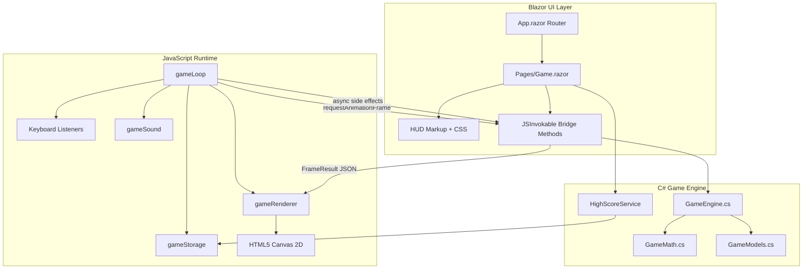
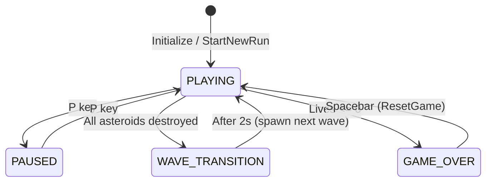
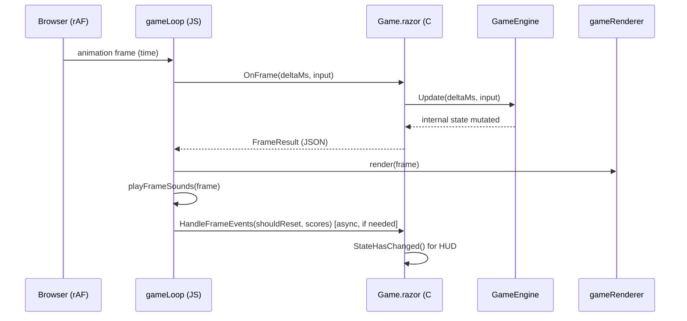
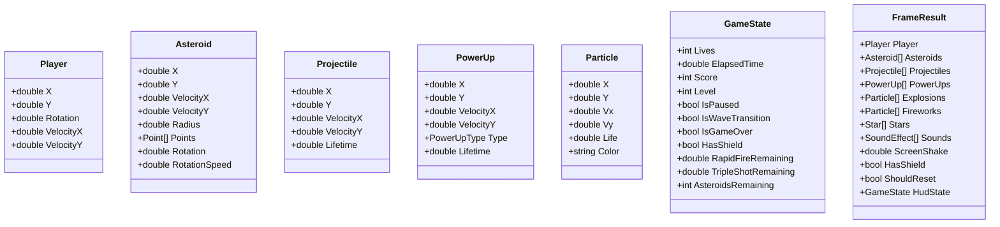

# Solution Architecture: Asteroids Blazor WebAssembly Implementation

This document describes the technical architecture of the Blazor WebAssembly Asteroids game (sibling project: `../asteroids01`).

## 1. High-Level System Overview

The application is a browser-based 2D arcade game built with **Blazor WebAssembly (.NET 10, C# 14)** and the **HTML5 Canvas API**. It uses a **hybrid C#/JavaScript architecture**:

- **C#** owns game logic, physics, collision detection, scoring, wave progression, and power-up rules.
- **JavaScript** owns the render loop, canvas drawing, keyboard input, procedural audio, and `localStorage`.
- **Blazor** provides the HUD overlay and the JS interop bridge between the two runtimes.

This split mirrors the React version's "ref-state" pattern: high-frequency simulation runs outside the UI reconciliation path, while low-frequency HUD updates flow through Blazor component state. Critical HUD transitions (pause, wave change, game over, power-up timers) are also pushed from `OnFrame` when `FrameResult.HudState` changes.

### System Architecture Diagram



---

## 2. Technology Stack

| Layer | Technology | Purpose |
| :--- | :--- | :--- |
| **Runtime** | .NET 10 WebAssembly | Runs C# in the browser |
| **UI Framework** | Blazor WebAssembly | Component model, routing, HUD |
| **Language** | C# 14 | Game engine, types, services |
| **Rendering** | HTML5 Canvas 2D (JavaScript) | 60 FPS drawing with glow, particles, screen shake |
| **Interop** | `IJSRuntime` + `[JSInvokable]` | Bidirectional C# ↔ JS communication |
| **Audio** | Web Audio API (JavaScript) | Procedural thrust, shoot, explosion, firework sounds |
| **Persistence** | `localStorage` (JavaScript) | Top 10 best survival times |
| **Styling** | CSS (`wwwroot/css/app.css`) | Glass-style HUD, overlays, scanline effect |

---

## 3. Project Structure

```
asteroids_blazor/
├── Program.cs                 # WASM host bootstrap, DI registration
├── App.razor                  # Router
├── Pages/
│   └── Game.razor             # Main game page, HUD, JS interop bridge
├── Layout/
│   └── EmptyLayout.razor      # Minimal full-screen layout (no nav chrome)
├── Game/
│   ├── GameEngine.cs          # Core simulation loop logic
│   ├── GameMath.cs            # Utilities, collision, procedural generation
│   └── GameConstants.cs       # Balance constants (lives, waves, power-ups)
├── Models/
│   └── GameModels.cs          # Entity DTOs, GameState, FrameResult
├── Services/
│   ├── HighScoreService.cs    # localStorage wrapper via JS interop
│   └── GameSoundService.cs    # Audio wrapper (registered; sounds played in JS loop)
└── wwwroot/
    ├── index.html             # Host page, Blazor + game.js script tags
    ├── css/app.css            # HUD and overlay styling
    └── js/game.js             # Game loop, renderer, audio, storage
```

---

## 4. Game State Machine

The game is **endless wave-based**. Clearing all asteroids advances to the next wave rather than ending the run. The player loses only when lives reach zero.



During **PAUSED** and **WAVE_TRANSITION**, gameplay entities are frozen but particle effects (explosions, fireworks) continue to animate. Mission timer and timed power-up buffs are also frozen during these states.

---

## 5. The Game Loop & Execution Flow

The browser drives timing via `requestAnimationFrame` in `wwwroot/js/game.js`. Each frame:

1. JS computes `delta` time since the last frame.
2. JS calls `dotNetRef.invokeMethodAsync('OnFrame', delta, input)` into C#.
3. C# runs `GameEngine.Update()` and returns a `FrameResult` snapshot.
4. JS renders the snapshot to canvas, plays sounds, and dispatches async side effects.

### Execution Sequence



### Frame-rate Independence

Movement uses **delta time** (`dt` in seconds):

```
position += velocity * dt
rotation += angularSpeed * dt
```

This keeps gameplay consistent regardless of frame rate.

---

## 6. JS Interop Design

### Synchronous frame path (`OnFrame`)

`OnFrame` is intentionally **synchronous and side-effect-free** with respect to JavaScript. It must not call `IJSRuntime` or `InvokeAsync` during the call, because it is invoked from within the JS animation loop. Re-entrant async interop from a sync callback can deadlock or silently break Blazor WASM.

`OnFrame` returns a `FrameResult` containing everything JS needs for that frame:

- Entity positions and velocities
- Star field data
- Particle lists (explosions, fireworks)
- Power-up pickups and active buff display fields
- Sound effect enums to play
- Screen shake intensity
- `ShouldReset` flag and pending high-score times
- `HudState` snapshot for responsive overlay updates

`Game.razor` compares `FrameResult.HudState` against local `_gameState` and calls `StateHasChanged()` when pause, wave transition, game over, level, or power-up timers change.

### Asynchronous side-effect path (`HandleFrameEvents`)

After rendering, JS optionally calls `HandleFrameEvents(shouldReset, pendingScores)` for work that requires async interop:

- Persisting high scores to `localStorage`
- Resetting the game on spacebar after game over

### Other interop entry points

| Method | Direction | Purpose |
| :--- | :--- | :--- |
| `OnResize(width, height)` | JS → C# | Canvas resize; initialize or regenerate stars |
| `gameLoop.start(canvas, dotNetRef)` | C# → JS | Start rAF loop, attach keyboard listeners |
| `gameLoop.stop()` | C# → JS | Tear down on component dispose |
| `gameStorage.*` | C# → JS | Read/write high scores |
| `gameSound.play(...)` | JS (internal) | Procedural audio synthesis |

---

## 7. Data Model & Entities



All entities are plain mutable objects for performance. `FrameResult` is a per-frame snapshot serialized to JSON for JavaScript.

---

## 8. Implementation Deep Dives

### 8.1 Hybrid State Management

| Concern | Owner | Update Frequency |
| :--- | :--- | :--- |
| Physics, collisions, entity lists | `GameEngine` (C# fields) | Every frame (~60 Hz) |
| Canvas pixels | `gameRenderer` (JS) | Every frame |
| HUD (time, score, wave, lives, buffs) | `Game.razor` Blazor state | Every 100 ms via timer; immediate on key `HudState` changes |
| High scores | `HighScoreService` + `localStorage` | On game-over restart |

The HUD timer calls `_engine.SyncHudState()` and then `StateHasChanged()` on the Blazor dispatcher. `OnFrame` additionally syncs `_gameState` from `HudState` when pause, wave, game over, or power-up display changes — so overlays appear on the same frame as the underlying event.

### 8.2 Run Lifecycle (`StartNewRun`)

`Initialize()` and `ResetGame()` share a single reset path:

- **`Initialize(width, height)`** — sets canvas size, regenerates stars, calls `StartNewRun()`, marks engine initialized.
- **`ResetGame()`** — records survival time to high scores (if `finalTime > 0`), then calls `StartNewRun()`.
- **`StartNewRun()`** — clears all run state (entities, pause, wave, score, lives, power-ups), spawns wave 1, and syncs `GameState`.

`Resize()` only updates canvas dimensions and regenerates the star field; it does not reset an in-progress run.

### 8.3 Physics & Collision Engine

- **Integration**: Euler integration (`pos += vel * dt`).
- **Screen wrapping**: Player and projectiles use `Wrap()`. Asteroids and power-ups use `WrapRadius()` so they fully exit the viewport before reappearing.
- **Collision helper**: `GameMath.CirclesOverlap(ax, ay, rA, bx, by, rB)` wraps `GameMath.Dist` and checks `dist < rA + rB`.
- **Projectile ↔ asteroid**: Point projectile (radius 0) vs asteroid radius.
- **Player ↔ asteroid**: Player hit padding (`PlayerHitPadding = 10`) vs asteroid radius. **One collision resolved per frame** via `ResolvePlayerCollisions()` to prevent multi-life loss from overlapping rocks.
- **Player ↔ power-up**: Pickup padding + power-up radius.
- **Asteroid splitting**: Large → two medium; medium → two small; small → destroyed.

### 8.4 Scoring

Points are awarded when an asteroid is destroyed:

| Asteroid size | Radius | Points |
| :--- | :--- | :--- |
| Large | 40 | 20 |
| Medium | 25 | 50 |
| Small | 15 | 100 |

Score resets on `StartNewRun()`. High scores track **survival time** (lower is better), recorded when restarting after game over.

### 8.5 Wave Progression

When all asteroids are cleared:

1. A 2-second **wave transition** begins (fireworks, overlay, frozen gameplay).
2. Wave number increments; a new wave spawns with more large asteroids and higher speeds.
3. Mission timer and active timed buffs are frozen for the transition duration.

| Wave | Large asteroids | Speed range (approx.) |
| :--- | :--- | :--- |
| 1 | 8 | 40–120 |
| 2 | 10 | 52–132 |
| 3 | 12 | 64–144 |

Formula: `count = NumLargeAsteroids + (level - 1) * WaveAsteroidsPerLevel`; speed bonus scales by `(level - 1) * WaveSpeedBonusPerLevel` up to `MaxAsteroidSpeedCap`.

### 8.6 Power-ups

| Type | Effect | Duration |
| :--- | :--- | :--- |
| **Shield** | Absorbs one asteroid hit | Until consumed |
| **Rapid Fire** | Hold Space to fire every 0.12 s | 8 s |
| **Triple Shot** | Fires 3 projectiles at ±15° | 8 s |

- **Drop chance**: 15% on asteroid destroy.
- **Pickup lifetime**: 10 s while drifting on the field.
- **Timed buff freeze**: Rapid Fire and Triple Shot timers are extended by pause duration and wave-transition duration (same principle as the mission timer).
- **Rendering**: JS draws pulsing pickup orbs (S/R/T) and a shield ring around the ship.

### 8.7 Pause

- Toggle with **P** (one-shot pulse from JS).
- Freezes movement, shooting, collisions, and mission timer.
- Explosion and firework particles continue to update and render.
- Timed power-up buffs do not drain while paused.

### 8.8 Procedural Asteroid Generation

Asteroids are irregular polygons, not circles:

1. Place vertices around a circle at randomized angles.
2. Apply a random radius multiplier (0.7–1.3×) per vertex.
3. Connect vertices to form a jagged rock outline.

### 8.9 Visual Effects (JavaScript Renderer)

The renderer adds polish beyond the original wireframe aesthetic:

- Parallax star field with twinkling and nebula gradients
- Neon glow via `shadowBlur` on ship, asteroids, and lasers
- Engine trail particles while thrusting
- Explosion spark particles on asteroid destruction and player hits
- Power-up pickup orbs and active shield ring
- Screen shake on impacts
- Vignette and subtle scanline overlay (CSS)
- Blazor overlays for pause, wave transition, and game over

### 8.10 Sound Engine (Procedural Synthesis)

Audio is synthesized in JavaScript using the Web Audio API — no audio files:

| Effect | Technique |
| :--- | :--- |
| **Thrust** | Triangle wave + 6 Hz LFO frequency modulation |
| **Shoot** | Square wave with rapid frequency decay |
| **Explosion** | Multiple overlapping sawtooth/square oscillators |
| **Player hit** | Sawtooth with low-frequency ramp |
| **Firework crackle** | Short burst square waves on wave clear |

### 8.11 High Scores

- Stored in `localStorage` under key `asteroids_highscores`.
- Lower time is better (longest survival / fastest run tracking uses elapsed mission time).
- Top 10 times are kept, sorted ascending.
- Recorded once when restarting after **game over** (`ResetGame`).

---

## 9. Startup & Hosting

```
index.html
  └─ blazor.webassembly.js   (boots .NET WASM runtime)
  └─ game.js                  (registers window.gameLoop, gameRenderer, etc.)

Program.cs
  └─ WebAssemblyHostBuilder
       ├─ RootComponents: App → #app
       └─ DI: HighScoreService, GameSoundService

App.razor → Router → Pages/Game.razor (route: /)
```

`Game.razor` initializes in `OnAfterRenderAsync`:

1. Load high scores.
2. Create `DotNetObjectReference` for JS callbacks.
3. Initialize `GameEngine` with viewport dimensions.
4. Call `gameLoop.start(canvas, dotNetRef)`.
5. Start HUD refresh timer.

On dispose, the component stops the loop and releases the `DotNetObjectReference`.

---

## 10. Development Notes

### Running locally

```bash
cd asteroids_blazor
dotnet run
```

Then open the URL shown in the console (typically `http://localhost:5xxx`).

### Asset fingerprinting

Blazor fingerprints framework files on each build (e.g. `dotnet.zixyp22md7.js`). If the dev server is not restarted after a rebuild, the browser may receive 404s for stale hashed assets and remain stuck on the loading spinner. **Always restart `dotnet run` after `dotnet build`.**

### Controls

| Input | Action |
| :--- | :--- |
| Arrow keys / WASD | Rotate and thrust |
| Spacebar | Fire (hold with Rapid Fire active) |
| P | Toggle pause |
| Spacebar (game over) | Restart |

---

## 11. Comparison with asteroids01 (React)

| Aspect | asteroids01 (React) | asteroids_blazor (Blazor) |
| :--- | :--- | :--- |
| UI framework | React 19 | Blazor WebAssembly |
| Game logic | TypeScript in `App.tsx` | C# in `GameEngine.cs` |
| Render loop | React `useGameLoop` hook | JS `gameLoop` + `[JSInvokable]` |
| HUD | React inline JSX | Blazor Razor markup |
| State pattern | `useRef` + `useState` | `GameEngine` fields + Blazor state |
| Build tool | Vite | .NET SDK + Blazor Dev Server |

Both versions share procedural audio and a canvas-rendered aesthetic. The Blazor port uses a layered C#/JS architecture with wave progression, scoring, power-ups, and pause — driven by Blazor interop and a dedicated `GameEngine` simulation core.